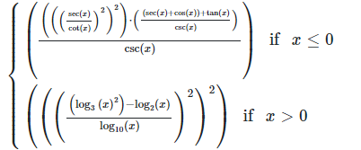
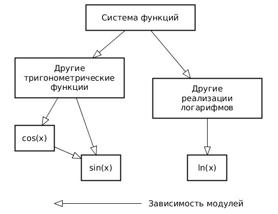
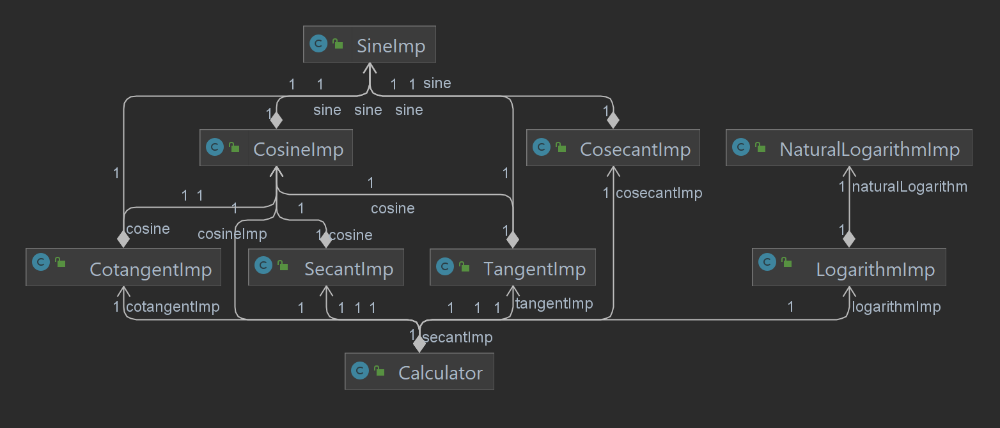
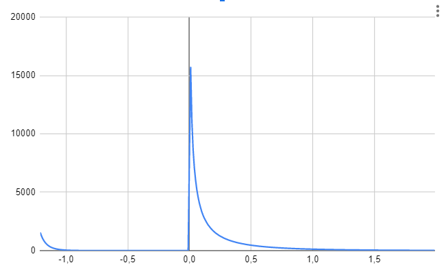
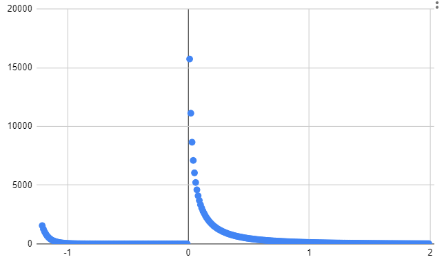

# Лабораторная работа №2 по ТПО

**Группа**: P33102

**Выполнили**: Оскилко Михаил и Бойко Владислав

**Вариант**: 11

x <= 0 : (((((sec(x) / cot(x)) ^ 2) ^ 2) * (((sec(x) + cos(x)) + tan(x)) / csc(x))) / csc(x))

x > 0 : (((((log_3(x) ^ 2) - log_2(x)) / log_10(x)) ^ 2) ^ 2)

## Правила выполнения работы:

1. Все составляющие систему функции (как тригонометрические, так и логарифмические) должны быть выражены через базовые (тригонометрическая зависит от варианта; логарифмическая - натуральный логарифм).
2. Структура приложения, тестируемого в рамках лабораторной работы, должна выглядеть следующим образом (пример приведён для базовой тригонометрической функции sin(x)):

3. Обе "базовые" функции (в примере выше - sin(x) и ln(x)) должны быть реализованы при помощи разложения в ряд с задаваемой погрешностью. Использовать тригонометрические / логарифмические преобразования для упрощения функций ЗАПРЕЩЕНО.
4. Для КАЖДОГО модуля должны быть реализованы табличные заглушки. При этом, необходимо найти область допустимых значений функций, и, при необходимости, определить взаимозависимые точки в модулях.
5. Разработанное приложение должно позволять выводить значения, выдаваемое любым модулем системы, в сsv файл вида «X, Результаты модуля (X)», позволяющее произвольно менять шаг наращивания Х. Разделитель в файле csv можно использовать произвольный.

## Порядок выполнения работы:

1. Разработать приложение, руководствуясь приведёнными выше правилами.
2. С помощью JUNIT4 разработать тестовое покрытие системы функций, проведя анализ эквивалентности и учитывая особенности системы функций. Для анализа особенностей системы функций и составляющих ее частей можно использовать сайт https://www.wolframalpha.com/.
3. Собрать приложение, состоящее из заглушек. Провести интеграцию приложения по 1 модулю, с обоснованием стратегии интеграции, проведением интеграционных тестов и контролем тестового покрытия системы функций.

## Отчёт по работе должен содержать:

1. Текст задания, систему функций.
2. UML-диаграмму классов разработанного приложения.
3. Описание тестового покрытия с обоснованием его выбора.
4. Графики, построенные csv-выгрузкам, полученным в процессе интеграции приложения.
5. Выводы по работе.

## Вопросы к защите лабораторной работы:

1. Цели и задачи интеграционного тестирования. Расположение фазы интеграционного тестирования в последовательности тестов; предшествующие и последующие виды тестирования ПО.
2. Алгоритм интеграционного тестирования.
3. Концепции и подходы, используемые при реализации интеграционного тестирования.
4. Программные продукты, используемые для реализации интеграционного тестирования. Использование JUnit для интеграционных тестов.
5. Автоматизация интеграционных тестов. ПО, используемое для автоматизации интеграционного тестирования.

[Ссылка на график](https://www.desmos.com/calculator/jms4pmi5js)

## UML

## График построенные по CSV точкам

## Выводы:

Выполняя данное задание, мы познакомились с основами интеграционного тестирования. Используя стратегию снизу-вверх, мы написали разнообразные тесты для нашей программа, а так же при написании использовали анализ эквивалентности. Благодаря знаниям математики, в частности геометрии и тригонометрии, я смог оцень необходимые промежутки для анализа эквивалентности по графику данной функции, а так же благополучни написать ОДЗ для тестов. По итогу нашего выполнения получился такой график, как показан на фото, тут как раз и видна выкалатаю точка, что явно помогает увидеть картину тестов лучше, нежели смотреть в тупую на код. Так же мы несложными манипуляциями создали UML-диаграму классов, что позволило легче написать интеграционные тесты. По итогу работы мы освоили новые знания, которые явно помогут нам в будущем.
